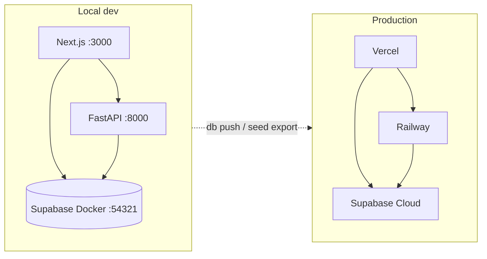

# Migration Plan — Supabase Production → Local Docker

**Created**: 2026-05-23  
**Owner**: Tai (BrSE)  
**Goal**: Develop against a local Supabase stack with production-like data, then promote schema changes to hosted Supabase via Git.

---

## Evaluation of existing docs

| Document | Purpose | Status for this task |
|----------|---------|----------------------|
| `docs/spec/03_design/migration_plan.md` | **Schema** migration (meals/products, RLS, new tables) from 2026-05-10 | Already applied on production. Still valid as history; **not** the Docker/local-dev plan. |
| `backend/migrations/*.sql` | Manual SQL run in Supabase SQL Editor | Superseded for new work by `supabase/migrations/` (CLI-managed). |
| **This file** | **Local Docker + data sync + deploy loop** | Active plan. |

### Production API errors (context)

Recent production 401s were caused by **JWT algorithm mismatch** (ES256 tokens vs HS256-only verification). That is fixed in `backend/app/core/jwt_verify.py` (JWKS + legacy HS256). Local Docker uses the default Supabase demo JWT secret (HS256), which matches `backend/.env.local.example`.

---

## Architecture



---

## What was implemented

| Item | Path |
|------|------|
| Supabase CLI project | `supabase/config.toml` |
| Baseline schema + RLS | `supabase/migrations/20260523090125_shopping_memo_baseline.sql` |
| Production data seed | `supabase/seed.sql` (~98KB) |
| Re-export script | `scripts/export_supabase_seed.py` |
| Auth identity metadata | `supabase/.seed_identities.json` |
| Local env templates | `backend/.env.local.example`, `frontend/.env.local.example` |

**Verified local counts** (match production): meals 45, products 80, meal_plans 2, auth.users 2.

---

## Daily workflow

### 1. Start local Supabase

```bash
# Docker Desktop must be running
supabase start
```

Studio: http://127.0.0.1:54323  
API: http://127.0.0.1:54321

### 2. Configure app env

```bash
cp backend/.env.local.example backend/.env.local
cp frontend/.env.local.example frontend/.env.local
```

`backend/app/core/config.py` loads `.env` then `.env.local` (local overrides).

### 3. Reset DB (migrations + seed)

```bash
supabase db reset
```

### 4. Run app

```bash
# Terminal 1
cd backend && export PYTHONPATH=$PYTHONPATH:. && python3 -m uvicorn app.main:app --reload

# Terminal 2
cd frontend && npm run dev
```

Log in with the **same email/password as production** (users are copied into local `auth.users`).

### 5. Refresh seed from production (optional)

When production data changes:

```bash
# backend/.env must point at production Supabase (service role)
backend/venv/bin/python scripts/export_supabase_seed.py
supabase db reset
```

---

## Schema changes (local → production)

1. Create migration: `supabase migration new describe_change`
2. Edit SQL under `supabase/migrations/`
3. Test: `supabase db reset`
4. Commit migration files to Git
5. Link CLI (one-time): `supabase login` then `supabase link --project-ref akyxznfvwogxhcwocukj`
6. Push to cloud: `supabase db push`

Do **not** use `apply_migration` MCP for iterative local schema work (creates remote history noise). Use migrations in repo.

---

## Environment matrix

| Variable | Local (Docker) | Production |
|----------|----------------|------------|
| `SUPABASE_URL` / `NEXT_PUBLIC_SUPABASE_URL` | `http://127.0.0.1:54321` | `https://akyxznfvwogxhcwocukj.supabase.co` |
| Anon key | From `supabase status -o env` | Supabase Dashboard |
| JWT | HS256 demo secret locally | ES256 + JWKS on backend |

Production deploy (Railway/Vercel) keeps using **hosted** Supabase env vars — no Docker in CI.

---

## Prerequisites

- Docker Desktop
- [Supabase CLI](https://supabase.com/docs/guides/cli) (`brew install supabase/tap/supabase`)
- `backend/.env` with production `SUPABASE_SERVICE_ROLE_KEY` (for seed export only)

---

## Risks & mitigations

| Risk | Mitigation |
|------|------------|
| `seed.sql` contains real user password hashes | Private repo; rotate if repo becomes public |
| Schema drift between `backend/migrations/` and `supabase/migrations/` | Use **only** `supabase/migrations/` going forward |
| Local keys are public defaults | Never use local keys in production |
| `supabase db push` without review | Always test with `supabase db reset` first |

---

## Next steps (recommended)

1. Run full app smoke test against local Supabase (login, meals, meal plan, shopping list).
2. `supabase login` + `supabase link` on your machine for `db pull` / `db push`.
3. After production errors are gone, re-export seed periodically or automate in a script.
4. Add CI job: `supabase db reset` + backend `pytest` (optional).

---

**Status**: Local stack implemented and seeded (2026-05-23).
