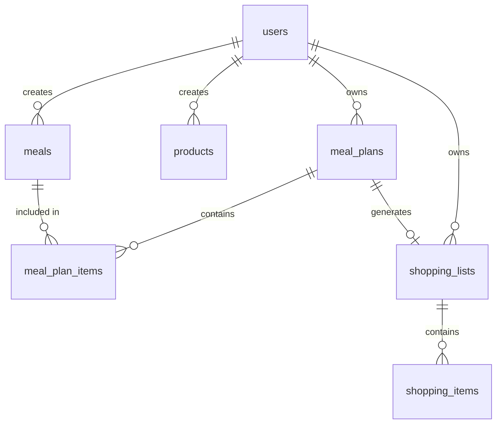

# Database Schema — Shopping Memo

**Date Created**: 2026-05-09  
**Last Updated**: 2026-05-24 (AI DB Optimizer - English Translation & Soft Delete enforcement)  
**Project**: Shopping Memo  
**Purpose**: Database Design and Table Definitions

---

## 1. Entity Relationship Diagram (ERD)



---

## 2. Table Definitions

### 2.1. `users` (Users table - Managed by Supabase Auth)
Managed via `auth.users` in Supabase, but extended here for application context.

| Column | Type | NULL | Default | Description |
|---|---|---|---|---|
| `id` | UUID | NO | `gen_random_uuid()` | Primary Key |
| `email` | VARCHAR(255) | NO | - | Unique email address |
| `display_name` | VARCHAR(100) | YES | - | User's display name |
| `created_at` | TIMESTAMP | NO | `now()` | Creation timestamp |
| `updated_at` | TIMESTAMP | NO | `now()` | Last update timestamp |

---

### 2.2. `meals` (Meal definitions)

| Column | Type | NULL | Default | Description |
|---|---|---|---|---|
| `id` | UUID | NO | `gen_random_uuid()` | Primary Key |
| `user_id` | UUID | NO | - | Foreign Key -> `users.id` |
| `name` | VARCHAR(100) | NO | - | Meal Name (Unique per user_id, case-insensitive) |
| `ingredients` | JSONB | NO | `'[]'::jsonb` | Array of strings for ingredients |
| `category` | VARCHAR(50) | YES | - | Category (e.g., washoku, yoshoku). *Re-added per Epic 2 US-003 requirements.* |
| `created_at` | TIMESTAMP | NO | `now()` | Creation timestamp |
| `updated_at` | TIMESTAMP | NO | `now()` | Last update timestamp |
| `deleted_at` | TIMESTAMP | YES | - | **Soft delete timestamp** |

**Indexes**:
- PRIMARY KEY: `id`
- FOREIGN KEY: `user_id` REFERENCES `auth.users(id)` ON DELETE CASCADE
- UNIQUE INDEX: `lower(name)` per `user_id` where `deleted_at IS NULL`
- INDEX: `user_id`, `deleted_at`

---

### 2.3. `products` (Daily necessities)

| Column | Type | NULL | Default | Description |
|---|---|---|---|---|
| `id` | UUID | NO | `gen_random_uuid()` | Primary Key |
| `user_id` | UUID | NO | - | Foreign Key -> `users.id` |
| `name` | VARCHAR(100) | NO | - | Product Name |
| `image_url` | TEXT | YES | - | URL to Supabase Storage `product-images` bucket |
| `category` | VARCHAR(50) | YES | - | Category. *Re-added per Epic 3 US-007 requirements.* |
| `created_at` | TIMESTAMP | NO | `now()` | Creation timestamp |
| `updated_at` | TIMESTAMP | NO | `now()` | Last update timestamp |
| `deleted_at` | TIMESTAMP | YES | - | **Soft delete timestamp** |

**Indexes**:
- PRIMARY KEY: `id`
- FOREIGN KEY: `user_id` REFERENCES `auth.users(id)` ON DELETE CASCADE
- INDEX: `user_id`, `deleted_at`

---

### 2.4. `meal_plans` (Weekly meal plans)

| Column | Type | NULL | Default | Description |
|---|---|---|---|---|
| `id` | UUID | NO | `gen_random_uuid()` | Primary Key |
| `user_id` | UUID | NO | - | Foreign Key -> `users.id` |
| `week_start_date` | DATE | NO | - | Start date of the week (Always Monday) |
| `status` | VARCHAR(20) | NO | `'draft'` | Status (`draft`, `active`, `completed`) |
| `created_at` | TIMESTAMP | NO | `now()` | Creation timestamp |
| `updated_at` | TIMESTAMP | NO | `now()` | Last update timestamp |
| `deleted_at` | TIMESTAMP | YES | - | **Soft delete timestamp** |

**Indexes**:
- PRIMARY KEY: `id`
- FOREIGN KEY: `user_id` REFERENCES `auth.users(id)` ON DELETE CASCADE
- UNIQUE INDEX: `user_id`, `week_start_date` where `deleted_at IS NULL`

---

### 2.5. `meal_plan_items` (Mapping meals to specific days)

| Column | Type | NULL | Default | Description |
|---|---|---|---|---|
| `id` | UUID | NO | `gen_random_uuid()` | Primary Key |
| `meal_plan_id` | UUID | NO | - | Foreign Key -> `meal_plans.id` |
| `meal_id` | UUID | NO | - | Foreign Key -> `meals.id` |
| `day_of_week` | INTEGER | NO | - | Day index (0=Monday ... 6=Sunday) |
| `created_at` | TIMESTAMP | NO | `now()` | Creation timestamp |

**Indexes**:
- PRIMARY KEY: `id`
- FOREIGN KEY: `meal_plan_id` REFERENCES `meal_plans(id)` ON DELETE CASCADE
- FOREIGN KEY: `meal_id` REFERENCES `meals(id)` ON DELETE RESTRICT (Prevents hard deleting a meal if it's in a plan)

---

### 2.6. `shopping_lists` (Shopping lists)

| Column | Type | NULL | Default | Description |
|---|---|---|---|---|
| `id` | UUID | NO | `gen_random_uuid()` | Primary Key |
| `user_id` | UUID | NO | - | Foreign Key -> `users.id` |
| `meal_plan_id` | UUID | YES | - | Foreign Key -> `meal_plans.id` |
| `week_from_date`| DATE | YES | - | Custom start date for completed histories |
| `week_to_date`  | DATE | YES | - | Custom end date for completed histories |
| `status` | VARCHAR(20) | NO | `'active'` | Status (`active`, `completed`) |
| `snapshot_json` | JSONB | YES | - | Snapshot of items when list is completed |
| `created_at` | TIMESTAMP | NO | `now()` | Creation timestamp |
| `updated_at` | TIMESTAMP | NO | `now()` | Last update timestamp |
| `completed_at` | TIMESTAMP | YES | - | When the list was finished |
| `deleted_at` | TIMESTAMP | YES | - | **Soft delete timestamp** |

**Indexes**:
- PRIMARY KEY: `id`
- FOREIGN KEY: `user_id` REFERENCES `auth.users(id)` ON DELETE CASCADE
- FOREIGN KEY: `meal_plan_id` REFERENCES `meal_plans(id)` ON DELETE SET NULL

---

### 2.7. `shopping_items` (Items inside a shopping list)

| Column | Type | NULL | Default | Description |
|---|---|---|---|---|
| `id` | UUID | NO | `gen_random_uuid()` | Primary Key |
| `shopping_list_id`| UUID | NO | - | Foreign Key -> `shopping_lists.id` |
| `name` | VARCHAR(100) | NO | - | Item name |
| `category` | VARCHAR(50) | NO | - | UI Grouping (e.g., Meal Name, "Khác") |
| `source_type` | VARCHAR(20) | NO | - | Enum: `meal`, `product`, `manual` |
| `source_id` | UUID | YES | - | Original Meal/Product ID (for traceability) |
| `note` | TEXT | YES | - | E.g., "Used for [Meal Name]" |
| `is_checked` | BOOLEAN | NO | `false` | Checked off status |
| `checked_at` | TIMESTAMP | YES | - | When the item was checked |
| `created_at` | TIMESTAMP | NO | `now()` | Creation timestamp |
| `updated_at` | TIMESTAMP | NO | `now()` | Last update timestamp |

**Indexes**:
- PRIMARY KEY: `id`
- FOREIGN KEY: `shopping_list_id` REFERENCES `shopping_lists(id)` ON DELETE CASCADE

---

## 3. Data Integrity & Validation Rules

### 3.1. Date and Time Constraints
```sql
-- Enforce Monday as start of week for meal plans
ALTER TABLE meal_plans ADD CONSTRAINT check_week_start_is_monday
CHECK (EXTRACT(ISODOW FROM week_start_date) = 1);

-- Enforce Day of Week range (0 to 6)
ALTER TABLE meal_plan_items ADD CONSTRAINT check_day_of_week_range
CHECK (day_of_week BETWEEN 0 AND 6);
```

### 3.2. Soft Delete Scope
All `GET` APIs MUST append `WHERE deleted_at IS NULL` to ensure soft-deleted records are invisible to the user.

---

## 4. Security: Row Level Security (RLS)

All tables must have RLS enabled to prevent IDOR (Insecure Direct Object Reference).

```sql
-- Example RLS Policy for Meals
ALTER TABLE meals ENABLE ROW LEVEL SECURITY;

CREATE POLICY "Users can only access their own meals"
ON meals
FOR ALL
USING (auth.uid() = user_id);
```

---

## 5. Storage Buckets

**Bucket Name**: `product-images`
- Visibility: Public Read
- Path Structure: `products/{user_id}/{timestamp}-{filename}`
- RLS Policy: Users can only Upload/Delete images within their own `{user_id}` folder.

---

**Status**: ✅ Active (Synced with Epic 2 & 3 English Requirements)
