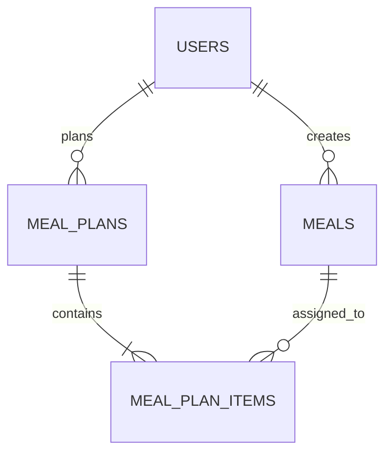

# Database Design: Meals Feature

This document details the database design for the **Meals (Meal Plan)** feature, ensuring consistency with the Serene Alignment design system and the approved API specifications.

## 1. Entity Relationship Diagram (ERD)

The Meals feature is centered around three primary entities:

- **Meals**: Master list of dishes available for planning.
- **Meal Plans**: Weekly containers for a user's meal schedule.
- **Meal Plan Items**: The mapping of a specific meal to a day and time slot (Breakfast, Lunch, Dinner).



## 2. Table Specifications

### 2.1. meals
Stores the master data for dishes.

| Column | Type | Constraints | Description |
| :--- | :--- | :--- | :--- |
| id | UUID | PK, DEFAULT gen_random_uuid() | Unique identifier |
| user_id | UUID | FK -> auth.users(id), NOT NULL | Owner of the meal |
| name | TEXT | NOT NULL | Name of the dish |
| ingredients | JSONB | DEFAULT '[]'::jsonb | List of ingredients |
| category | TEXT | NOT NULL, DEFAULT 'other' | Category (japanese, western, chinese, other) |
| created_at | TIMESTAMPTZ | DEFAULT now() | Creation timestamp |
| updated_at | TIMESTAMPTZ | DEFAULT now() | Last update timestamp |
| deleted_at | TIMESTAMPTZ | NULL | Soft delete support |

### 2.2. meal_plans
Represents a weekly meal schedule.

| Column | Type | Constraints | Description |
| :--- | :--- | :--- | :--- |
| id | UUID | PK, DEFAULT gen_random_uuid() | Unique identifier |
| user_id | UUID | FK -> auth.users(id), NOT NULL | Owner of the plan |
| week_start_date | DATE | NOT NULL | Must be a Monday |
| status | TEXT | NOT NULL, DEFAULT 'draft' | draft, active, completed |
| created_at | TIMESTAMPTZ | DEFAULT now() | Creation timestamp |
| updated_at | TIMESTAMPTZ | DEFAULT now() | Last update timestamp |

**Unique Constraint**: `(user_id, week_start_date)` - One plan per user per week.

### 2.3. meal_plan_items
Individual meal assignments within a plan.

| Column | Type | Constraints | Description |
| :--- | :--- | :--- | :--- |
| id | UUID | PK, DEFAULT gen_random_uuid() | Unique identifier |
| meal_plan_id | UUID | FK -> meal_plans(id), NOT NULL | Parent plan |
| meal_id | UUID | FK -> meals(id), NOT NULL | Assigned dish |
| day_of_week | INTEGER | NOT NULL (0-6) | 0=Monday, 6=Sunday |
| meal_type | TEXT | NOT NULL | breakfast, lunch, dinner |
| created_at | TIMESTAMPTZ | DEFAULT now() | Creation timestamp |

**Unique Constraint**: `(meal_plan_id, day_of_week, meal_type)` - One dish per slot.

## 3. SQL Implementation Script

```sql
-- Create meals table
CREATE TABLE IF NOT EXISTS public.meals (
    id uuid PRIMARY KEY DEFAULT gen_random_uuid(),
    user_id uuid NOT NULL REFERENCES auth.users(id) ON DELETE CASCADE,
    name text NOT NULL,
    ingredients jsonb NOT NULL DEFAULT '[]'::jsonb,
    category text NOT NULL DEFAULT 'other' CHECK (category IN ('japanese', 'western', 'chinese', 'other')),
    created_at timestamptz NOT NULL DEFAULT now(),
    updated_at timestamptz NOT NULL DEFAULT now(),
    deleted_at timestamptz
);

-- Create meal_plans table
CREATE TABLE IF NOT EXISTS public.meal_plans (
    id uuid PRIMARY KEY DEFAULT gen_random_uuid(),
    user_id uuid NOT NULL REFERENCES auth.users(id) ON DELETE CASCADE,
    week_start_date date NOT NULL,
    status text NOT NULL DEFAULT 'draft' CHECK (status IN ('draft', 'active', 'completed')),
    created_at timestamptz NOT NULL DEFAULT now(),
    updated_at timestamptz NOT NULL DEFAULT now(),
    CONSTRAINT meal_plans_user_week_unique UNIQUE (user_id, week_start_date),
    CONSTRAINT meal_plans_monday_check CHECK (EXTRACT(DOW FROM week_start_date) = 1)
);

-- Create meal_plan_items table
CREATE TABLE IF NOT EXISTS public.meal_plan_items (
    id uuid PRIMARY KEY DEFAULT gen_random_uuid(),
    meal_plan_id uuid NOT NULL REFERENCES public.meal_plans(id) ON DELETE CASCADE,
    meal_id uuid NOT NULL REFERENCES public.meals(id) ON DELETE RESTRICT,
    day_of_week integer NOT NULL CHECK (day_of_week BETWEEN 0 AND 6),
    meal_type text NOT NULL CHECK (meal_type IN ('breakfast', 'lunch', 'dinner')),
    created_at timestamptz NOT NULL DEFAULT now(),
    CONSTRAINT meal_plan_items_unique UNIQUE (meal_plan_id, day_of_week, meal_type)
);

-- Optimization Indexes
CREATE INDEX IF NOT EXISTS idx_meals_user_category ON public.meals(user_id, category) WHERE deleted_at IS NULL;
CREATE INDEX IF NOT EXISTS idx_meal_plans_user_date ON public.meal_plans(user_id, week_start_date);
CREATE INDEX IF NOT EXISTS idx_meal_plan_items_plan_id ON public.meal_plan_items(meal_plan_id);
```

## 4. Performance & Scalability Considerations

- **Indexing**: Composite indexes are used on `(user_id, week_start_date)` and `(user_id, category)` to ensure fast lookups for the main UI views.
- **Data Integrity**: Foreign key constraints with `ON DELETE CASCADE` ensure no orphaned data, while `ON DELETE RESTRICT` for `meal_id` prevents deleting dishes that are currently in use in a meal plan.
- **Soft Delete**: The `deleted_at` column in `meals` allows users to remove dishes from their list without breaking historical meal plans.
- **Normalization**: The schema is in 3NF, reducing redundancy and ensuring that updates to a meal's name or ingredients reflect across all future views.

## 5. Deployment Guide

1. **Prerequisites**: Ensure you have access to the Supabase SQL Editor or a PostgreSQL client.
2. **Execution**: Run the provided SQL script in the `public` schema.
3. **RLS Configuration**: Enable Row Level Security for all tables and define policies to restrict data access to the owning `user_id` (see `backend/migrations/004_setup_rls.sql`).
4. **Validation**: Use the verification queries provided in `backend/migrations/003_create_new_tables.sql` to confirm table structures and constraints.
